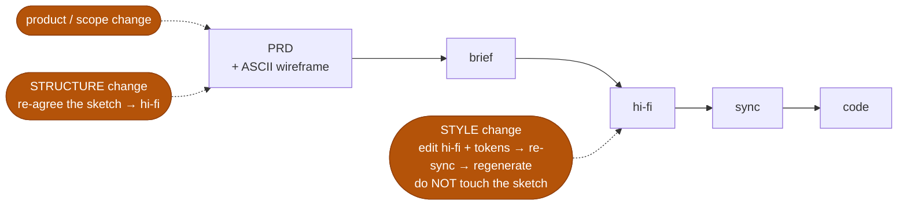

# Argo pipeline — from thought to shipped code, end to end

This is the whole path a feature travels in an Argo project: a raw idea becomes a
grounded product spec (carrying its user-agreed layout intent), the spec becomes
a hi-fi design, and the design is handed to the builder and turned into tested
code. Two loops — **design** and **code** — joined by one seam: the **handoff**
(hi-fi → synced context → code).

Each stage has one owner (a skill or agent), a defined input and output, and a
gate that must pass before the next stage starts. Nothing downstream is built on
an ungated upstream.

```mermaid
flowchart LR
    classDef stage fill:#1e293b,color:#fff,stroke:#475569
    classDef seam fill:#0f766e,color:#fff,stroke:#115e59
    classDef gate fill:#7c3aed,color:#fff,stroke:#5b21b6

    thought([THOUGHT]) --> prd
    prd["PRD<br/>product / write-prd<br/><i>WHAT & WHY + ASCII wireframe + flow</i>"]:::stage
    brief["brief<br/>.argo/design/briefs/<br/><i>per-screen spec, cites the PRD's sketch</i>"]:::stage
    manifest{"decision gate<br/>binding manifest<br/>vs registry"}:::gate
    hifi["hi-fi<br/>design-screen<br/><i>pixel design, component-first</i>"]:::stage
    dv{"design-verifier<br/>gate"}:::gate
    handoff[["HANDOFF<br/>figma-sync<br/><i>story-map · tokens · specs</i>"]]:::seam
    code["code<br/>figma-to-code → test-first<br/><i>behavior TDD'd, tokens applied</i>"]:::stage
    rev{"reviewer →<br/>integrator"}:::gate
    shipped([SHIPPED CODE])

    prd --> brief --> manifest --> hifi --> dv --> handoff --> code --> rev --> shipped
```

## The stages

| # | Stage | Owner | Input | Output | Gate before moving on |
|---|-------|-------|-------|--------|------------------------|
| 1 | **Product** | `argo:product` / `write-prd` | a raw idea | PRD in `.claude/prds/` — durable WHAT/WHY, requirements + acceptance, feature→screen matrix, **ASCII wireframe + flow per screen (user-agreed)** | the PRD exists, each requirement has an acceptance pair, and the user has confirmed each screen's layout sketch |
| 2 | **Grill** (as needed) | `grill-me` | PRD / a design decision | sharpened decisions, a design doc for non-trivial forks | no unresolved guess remains |
| 3 | **Brief** | author (per "no brief, no hi-fi") | PRD projected onto one screen | screen brief in `design/briefs/` — regions, Flow/IA, **Stage arrangement**, `Reference image` citing the PRD's ASCII wireframe | the brief covers every PRD `Visible in build?` requirement for the screen |
| 4 | **Decision gate** | `design-screen` (P0) | brief + registry | `design/<wave>/binding-manifest.json` + copy deck, validated by `argo design validate-manifest` | manifest passes (registry existence, confusable-pairs, Always/Ask-first/Never) |
| 5 | **Hi-fi** | `design-screen` (`figma-create` for one component) | brief + PRD's ASCII wireframe | hi-fi Figma, built component-first | hard **tier-0 audit** + deterministic instance-presence check; **`design-verifier`** (advisory, adversarial, given-only) rules every PRD requirement present |
| 6 | **Sync** | `figma-sync` | the hi-fi Figma file | committed design context — tokens, specs, `story-map.json`, reference screenshots, freshness metadata; regenerated CSS | the target component has a `story-map.json` entry |
| 7 | **Handoff → code** | `figma-to-code` | the synced context | real component code, generated through **`test-first`** | tiered acceptance gates in order: **spec-diff → gestalt → baseline commit** |
| 8 | **Feature build** | `test-first` (interactive) / `build-plan` (hands-off) | generated components + plan | the feature, wired together, tests green | commit gates / receipts |
| 9 | **Review → Debug → Land** | `reviewer` · `root-cause` · `integrator` | the diff/branch | reviewed, merged work + PR/release notes | merge-gate review passes |

There is no separate lo-fi wireframing stage: layout exploration happens as
text, inside the PRD interview, where changing a layout costs one edit and one
question to the user — not a Figma file to maintain in sync. The retired
contract-freeze machinery (a frozen `region-contract` extracted from a Figma
wireframe) is gone with it; the PRD is the completeness oracle.

## The seam — the HANDOFF (hi-fi → builder → code)

This is the design→code bridge, the part most pipelines leave implicit. It is
**two steps, not one**:

1. **`figma-sync`** dumps the Figma design source of truth into **committed
   artifacts** — `design/story-map.json` (the Figma-node → code-component map),
   design tokens, per-variant/mode specs, reference screenshots, freshness
   metadata — and regenerates the generated CSS region. After this, the design
   lives in the repo as data; the builder never needs live Figma access to build.
2. **`figma-to-code`** reads ONLY those committed artifacts and generates the
   component through the project's normal **`test-first`** loop: the component's
   *behavior* (props, state, interaction) is TDD'd red-first through the real
   rendered UI, and its *appearance* comes from the synced tokens/specs. It then
   proves itself with the tiered gates in order — **spec-diff** (does it match the
   design context?) → **gestalt** (does it look right?) → **baseline commit** —
   never baseline-then-review.

`figma-sync`'s three-class model decides *who owns each component*: design-owned
components are generated from Figma; **code-owned composites are never
generated** (the app assembles them from generated parts). Code Connect
(`figma-code-connect`) maps Figma components to their code counterparts so the
handoff resolves to real components, not re-invented ones.

So the full handoff sentence: **design-screen produces hi-fi → figma-sync commits
it as design context + a story-map → figma-to-code generates each design-owned
component test-first and gate-proven → build-plan/test-first assembles them into
the feature.** The builder is handed *committed artifacts*, never a live design it
has to interpret.

## Change management — re-enter at the ALTITUDE of the change

Re-enter the pipeline at the level the change actually touches; the PRD's ASCII
wireframe is the pivot (structure lives in it, style lives in hi-fi below it).

| What changed | Enters at | Path |
|---|---|---|
| **Product / scope** (new requirement, new screen, changed acceptance) | PRD | PRD (+ its ASCII wireframe) → brief → hi-fi → sync → code |
| **Structure / layout** (region added/removed, arrangement, a new panel) | the PRD's ASCII wireframe | re-agree the sketch with the user → brief → hi-fi → sync → code |
| **Style / visual** (color, spacing, token value, polish) | hi-fi + design tokens | hi-fi → `figma-sync` → `figma-to-code` regenerate |
| **Component behavior** (a new state/prop) | hi-fi + code (brief sub-parts if structural) | test-first → verify |

Why this is the efficient split, not just the tidy one:

- **Touching the sketch for a style change is waste** — the ASCII wireframe is
  deliberately style-free (region names and arrangement only), so a
  color/spacing change has nothing to update there. Go straight to hi-fi +
  tokens, re-sync, regenerate.
- **Editing structure directly in hi-fi is the expensive trap** — you'd be
  rearranging polished mocks, silently diverging from the layout the user
  signed off. Structure is cheap to re-agree in text; one edited sketch and one
  confirming question keep hi-fi honest.

The guardrail that makes "just edit hi-fi" safe: **`design-verifier`** checks
hi-fi against the PRD, so a structural change made only in hi-fi gets caught as
a PRD mismatch and forced back through the sketch → user re-agreement. You edit
hi-fi freely for style; the gate only stops you when the change was actually
structural and skipped its altitude.

## The gates that make the whole thing trustworthy

The adversarial checks are **independent and given-only** — handed only the
artifacts, never the building agent's transcript, so a builder can't grade its
own work:

- **`design-verifier`** (end of a hi-fi build) — rules each PRD `Visible in
  build?` requirement present/absent in the built screen. Stops an under-built
  or box-traced hi-fi from shipping.
- **`fidelity-verifier`** (supervisor-spawned, blind) — rules each region of
  the built screenshot matches/deviates against the reference (brief, the
  PRD's ASCII wireframe, or an original design), never a holistic score.

Downstream, `figma-to-code`'s spec-diff/gestalt gates and the normal code
review/commit gates carry the same principle into code.
