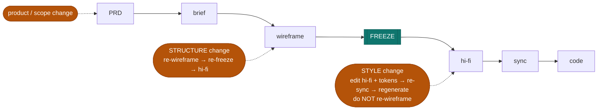

# Argo pipeline — from thought to shipped code, end to end

This is the whole path a feature travels in an Argo project: a raw idea becomes a
grounded product spec, a spec becomes screens, screens become a locked design,
and the design is handed to the builder and turned into tested code. Two loops —
**design** and **code** — joined by two seams: the **freeze** (wireframe →
contract) and the **handoff** (hi-fi → synced context → code).

Each stage has one owner (a skill or agent), a defined input and output, and a
gate that must pass before the next stage starts. Nothing downstream is built on
an ungated upstream.

```mermaid
flowchart LR
    classDef stage fill:#1e293b,color:#fff,stroke:#475569
    classDef seam fill:#0f766e,color:#fff,stroke:#115e59
    classDef gate fill:#7c3aed,color:#fff,stroke:#5b21b6

    thought([THOUGHT]) --> prd
    prd["PRD<br/>product / write-prd<br/><i>WHAT & WHY</i>"]:::stage
    brief["brief<br/>.claude/design/briefs/<br/><i>per-screen spec</i>"]:::stage
    wf["wireframe<br/>figma-wireframe<br/><i>lo-fi, explore & converge</i>"]:::stage
    wfv{"wireframe-verifier<br/>gate"}:::gate
    freeze[["FREEZE<br/>region-contract<br/><i>structural oracle</i>"]]:::seam
    hifi["hi-fi<br/>design-screen<br/><i>pixel design, component-first</i>"]:::stage
    dv{"design-verifier<br/>gate"}:::gate
    handoff[["HANDOFF<br/>figma-sync<br/><i>story-map · tokens · specs</i>"]]:::seam
    code["code<br/>figma-to-code → test-first<br/><i>behavior TDD'd, tokens applied</i>"]:::stage
    rev{"reviewer →<br/>integrator"}:::gate
    shipped([SHIPPED CODE])

    prd --> brief --> wf --> wfv --> freeze --> hifi --> dv --> handoff --> code --> rev --> shipped
```

## The stages

| # | Stage | Owner | Input | Output | Gate before moving on |
|---|-------|-------|-------|--------|------------------------|
| 1 | **Product** | `argo:product` / `write-prd` | a raw idea | PRD in `.claude/prds/` — durable WHAT/WHY, requirements + acceptance, feature→screen matrix | the PRD exists and each requirement has an acceptance pair |
| 2 | **Grill** (as needed) | `grill-me` | PRD / a design decision | sharpened decisions, a design doc for non-trivial forks | no unresolved guess remains |
| 3 | **Brief** | author (per "no brief, no wireframe") | PRD projected onto one screen | screen brief in `design/briefs/` — regions, Flow/IA, **Stage arrangement** | the brief covers every PRD `Visible in build?` requirement for the screen |
| 4 | **Wireframe** | `figma-wireframe` | the brief | lo-fi Figma frames — kit instances, one font, no style; **variations explored then converged** | **`wireframe-verifier`** (adversarial, given-only): scope · region coverage · arrangement · standing rules |
| 5 | **Freeze** | `design-screen` (P1) | the chosen wireframe | `design/contracts/<screen>.json` — the frozen **region-contract**, the structural oracle | contract extracted + committed (version-stamped) |
| 6 | **Hi-fi** | `design-screen` (`figma-create` for one component) | contract + brief | hi-fi Figma, built component-first, coverage-gated per commit | **`design-verifier`** (P5, adversarial, given-only) rules every region + PRD requirement present |
| 7 | **Sync** | `figma-sync` | the hi-fi Figma file | committed design context — tokens, specs, `story-map.json`, reference screenshots, freshness metadata; regenerated CSS | the target component has a `story-map.json` entry |
| 8 | **Handoff → code** | `figma-to-code` | the synced context | real component code, generated through **`test-first`** | tiered acceptance gates in order: **spec-diff → gestalt → baseline commit** |
| 9 | **Feature build** | `test-first` (interactive) / `build-plan` (hands-off) | generated components + plan | the feature, wired together, tests green | commit gates / receipts |
| 10 | **Review → Debug → Land** | `reviewer` · `root-cause` · `integrator` | the diff/branch | reviewed, merged work + PR/release notes | merge-gate review passes |

## Seam 1 — the FREEZE (wireframe → contract)

The region-contract is a **snapshot of the chosen wireframe's structure**, taken
once at stage 5. It is the oracle every later gate checks against, which is what
stops hi-fi from silently under-building or tracing flat boxes. Rules:

- Freeze the ONE wireframe you converged on (variants live and die at stage 4).
- Never re-extract mid-build to "match" what you built — that re-introduces the
  circularity the contract exists to prevent.
- The contract is a **version boundary, not a lock**: if the wireframe
  legitimately changes later, re-extract → a new frozen version (a human seam).

## Seam 2 — the HANDOFF (hi-fi → builder → code)

This is the design→code bridge, the part most pipelines leave implicit. It is
**two steps, not one**:

1. **`figma-sync`** dumps the Figma design source of truth into **committed
   artifacts** — `design/story-map.json` (the Figma-node → code-component map),
   design tokens, per-variant/mode specs, reference screenshots, freshness
   metadata — and regenerates the generated CSS region. After this, the design
   lives in the repo as data; the builder never needs live Figma access to build.
2. **`figma-to-code`** reads ONLY those committed artifacts and generates the
   component through the project's normal **`test-first`** loop: the component's
   *behavior* (props, state, interaction) is TDD'd red-first through the real
   rendered UI, and its *appearance* comes from the synced tokens/specs. It then
   proves itself with the tiered gates in order — **spec-diff** (does it match the
   design context?) → **gestalt** (does it look right?) → **baseline commit** —
   never baseline-then-review.

`figma-sync`'s three-class model decides *who owns each component*: design-owned
components are generated from Figma; **code-owned composites are never
generated** (the app assembles them from generated parts). Code Connect
(`figma-code-connect`) maps Figma components to their code counterparts so the
handoff resolves to real components, not re-invented ones.

So the full handoff sentence: **design-screen produces hi-fi → figma-sync commits
it as design context + a story-map → figma-to-code generates each design-owned
component test-first and gate-proven → build-plan/test-first assembles them into
the feature.** The builder is handed *committed artifacts*, never a live design it
has to interpret.

## Change management — re-enter at the ALTITUDE of the change

You do **not** go back to wireframes for every change. Re-enter the pipeline at
the level the change actually touches; the freeze is the pivot (structure above
it, style below it).

| What changed | Enters at | Re-wireframe? | Path |
|---|---|---|---|
| **Product / scope** (new requirement, new screen, changed acceptance) | PRD | only if it adds structure | PRD → brief → wireframe → re-freeze → hi-fi → sync → code |
| **Structure / layout** (region added/removed, arrangement, a new panel) | brief + wireframe | **yes** | wireframe → re-freeze → hi-fi → sync → code |
| **Style / visual** (color, spacing, token value, polish) | hi-fi + design tokens | **no** | hi-fi → `figma-sync` → `figma-to-code` regenerate |
| **Component behavior** (a new state/prop) | hi-fi + code (brief sub-parts if structural) | only if structural | test-first → verify |

Why this is the efficient split, not just the tidy one:

- **Re-wireframing for a style change is waste** — wireframes are deliberately
  style-free (one font, no color), so a color/spacing change has nothing to
  update there. Go straight to hi-fi + tokens, re-sync, regenerate.
- **Editing structure directly in hi-fi is the expensive trap** — you'd be
  rearranging polished mocks, and it silently breaks the contract so the
  completeness gate starts lying. Structure is cheap to explore in lo-fi, and the
  re-freeze keeps hi-fi honest.

The guardrail that makes "just edit hi-fi" safe: **`design-verifier`** checks
hi-fi against the frozen contract + PRD, so a structural change made only in hi-fi
gets caught as drift and forced back through the wireframe/re-freeze. You edit
hi-fi freely for style; the gate only stops you when the change was actually
structural and skipped its altitude.

## The two gates that make the whole thing trustworthy

Both are **independent and adversarial** — given only the artifacts, never the
building agent's transcript, so a builder can't grade its own work:

- **`wireframe-verifier`** (before the freeze) — rules each lo-fi frame in/out of
  scope, complete/incomplete, conformant/violating against the standing wireframe
  rules. Stops a bad wireframe from being frozen into a contract.
- **`design-verifier`** (before hi-fi lands) — rules each contract region + PRD
  requirement present/absent in the built screen. Stops an under-built or
  box-traced hi-fi from shipping.

Downstream, `figma-to-code`'s spec-diff/gestalt gates and the normal code
review/commit gates carry the same principle into code.
