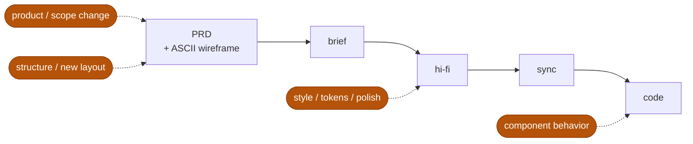

# argo — a portable engineering "way of working" for Claude Code

Argo turns Claude Code into an opinionated development pipeline: every stage of
**product → design → code → shipped** is owned by a skill or agent, and the seams
between stages are guarded by **mechanical gates** — so quality is enforced, not
requested. It ships as two pieces:

- **This plugin** — the thin Claude-facing layer: skills, agents, and hook wiring.
- **[`@argohq/toolkit`](packages/toolkit)** — one npm package holding every line of
  executable logic (gate implementations, the design kit, test walkers, reporters,
  the `argo` CLI). Hooks dispatch into it fail-closed: if the kit is missing, the
  gate **blocks** and names the fix, it never silently passes.

Opinionated about process, agnostic about stack: safe to drop into an existing
project, an excellent default for a greenfield one. Works with or without the
Argo cockpit app.

## The pipeline at a glance

```mermaid
flowchart LR
    classDef judge fill:#7c3aed,color:#fff,stroke:#5b21b6
    classDef det fill:#0f766e,color:#fff,stroke:#115e59
    classDef stage fill:#1e293b,color:#fff,stroke:#475569
    classDef app fill:#b45309,color:#fff,stroke:#92400e

    idea([raw idea]) --> prd

    subgraph P [PRODUCT]
        prd["write-prd<br/>PRD: WHAT / WHY<br/>requirements + acceptance<br/>+ ASCII wireframe + flow, user-agreed"]:::stage
        grill["grill-me<br/>stress-test every decision"]:::judge
    end
    prd --> grill

    subgraph D [DESIGN LOOP · Figma]
        brief["screen brief<br/>regions · flow · arrangement<br/>cites the PRD's ASCII wireframe"]:::stage
        manifest{"decision gate<br/>binding manifest vs registry<br/>deterministic"}:::det
        hifi["design-screen / design-component<br/>component-first hi-fi"]:::stage
        t0{"design-rules audit +<br/>instance-presence receipts<br/>deterministic"}:::det
        dv{"design-verifier<br/>adversarial LLM judge<br/>sees only PRD + screenshots"}:::judge
    end
    grill --> brief --> manifest --> hifi --> t0 --> dv

    subgraph H [HANDOFF · design → repo]
        sync["figma-sync<br/>tokens · specs · story-map<br/>committed as data"]:::stage
        f2c["build-screen / figma-to-code<br/>component-first → compose, test-first"]:::stage
        tiers{"spec-diff → gestalt → baseline<br/>tiered acceptance, in order"}:::det
    end
    dv --> sync --> f2c --> tiers

    subgraph C [CODE LOOP]
        plan["planner<br/>read-only plan from real code"]:::stage
        build["build-plan · hands-off<br/>test-first · interactive"]:::stage
        tdd{"probity<br/>red-first evidence per edit<br/>transcript-based validator"}:::det
        commitg{"red-proof + trust gates<br/>per commit, receipt-based"}:::det
    end
    tiers --> plan --> build
    build --- tdd
    build --> commitg

    subgraph L [LAND]
        review["reviewer<br/>merge-gate LLM judge"]:::judge
        integ["integrator<br/>PR · release notes · push"]:::stage
    end
    commitg --> review --> integ --> shipped([shipped code])

    debug["root-cause<br/>diagnosis before fixes"]:::judge
    review -. defects .-> debug
    debug -.-> build

    cockpit["Argo cockpit · optional app<br/>voice · parallel-fleet UI · Haiku router<br/>hosts stock claude sessions, never owns the loop"]:::app
    cockpit -. watches every stage .-> P & D & H & C & L
    cockpit == voice steer / run-the-app trust ==> build
```



**Purple = LLM judgment** (an adversarial or opinionated model call decides).
**Teal = deterministic** (a script checks receipts/artifacts; a model cannot talk
its way past it). The pipeline alternates them on purpose: judges decide *quality*,
deterministic gates make *skipping impossible*.
**Amber = the optional Argo cockpit app** — it hosts the stock `claude` sessions,
adds voice + a parallel-fleet UI + a Haiku router, and enforces the run-the-app
trust gate; it watches and steers the loop but never owns it. Every gate above
runs identically from a bare `claude` terminal with just this plugin.

The full stage-by-stage map — inputs, outputs, owners, and the one seam (the
design→code **handoff**) — lives in **[PIPELINE.md](PIPELINE.md)**.

## Two enforcement layers

| Gate | Fires when | Kind | What it blocks |
|---|---|---|---|
| safety guardrails (dangerous-git, pipe-to-shell, lockfile-edit, bash-source-write, designer-spawn) | every matching tool call, always on | deterministic, plugin-side | destructive/unsafe actions, edits that dodge the guards |
| probity | every Write/Edit while enabled | transcript-based TDD validator | implementation without a fresh failing test |
| red-proof + trust gates | every commit during a `/argo:build-plan` run | deterministic (receipts) | commits without fail→pass test evidence / launch proof |
| design-phase decision gate | before a hi-fi build starts | deterministic (binding manifest vs registry + confusable-pairs table) | building against components/tokens that don't exist; known-confusable name swaps |
| design-rules audit + design coverage | design-pack commits & Figma sessions | deterministic (receipts) | hi-fi drift from conventions; under-built regions; TEXT nodes with copy that traces to no deck/defaultStrings entry |
| spec-diff / VRT / base-congruence walkers | test runs after figma-sync | deterministic | generated code diverging from synced design data |
| design-verifier / fidelity-verifier | end of a hi-fi build | adversarial LLM judge | screens that miss PRD requirements; visual drift from the reference |
| reviewer | before merge | LLM judge | correctness/security defects in the diff |

Safety guardrails run verbatim from the plugin (dependency-free, alive before any
`npm install`). Everything else dispatches into `@argohq/toolkit` via
`npx --no @argohq/toolkit argo-hook <name>` and **fails closed** — a missing kit
blocks with the fix command (`bun install` / `/argo:init`). There is no
plugin↔kit version handshake: the plugin and kit release together, so the hook
just runs whatever kit is installed.

## Install

```
/plugin marketplace add milad-alizadeh/argo-plugin
/plugin install argo@argo            # project scope recommended
/argo:init                           # adapt to this project
```

`/argo:init` detects your stack and, with per-rule consent, writes what a project
actually keeps:

- `.argo/config.json` — the ONE argo config (landing mode, paths, per-app design blocks);
  `.argo/` is argo's only per-project directory (config + `plans/` + `design/` committed
  via a deny-by-default gitignore; everything else in it — evidence, receipts, secrets —
  stays ignored)
- `.claude/rules/*.md` — opinionated rules **adapted** to your stack (inert
  templates until then; see below)
- the `@argohq/toolkit` dependency + `.claude/settings.json` enablement
- optional: probity wiring, lefthook, graphify

Everything executable stays in the kit — updating argo never re-copies code into
your repo. `/argo:setup-design` (optional, per app) wires the Figma-to-code design
pack: shadcn + Storybook, walker shims, tiered gates.

**Auto-update:** third-party marketplaces don't auto-update by default — enable it
in `/plugin` → Marketplaces or via `extraKnownMarketplaces` in settings. Updating
the plugin (`claude plugin update argo@argo`) is the whole story — it brings the
matching kit, and there is no repo-side reconcile step. The installed
`.claude/rules/*.md` are static suggestions written once at `/argo:init`; they are
never re-synced or migrated against a plugin version. If a project predates a
breaking change, rip-and-re-init via a fresh `/argo:init`.

## The loop, day to day

1. **`/argo:write-prd`** — a raw idea becomes a grounded PRD (`.claude/prds/`),
   including a user-agreed **ASCII wireframe + flow** per screen — the layout
   sign-off, done in text, no Figma lo-fi stage.
2. **`/argo:grill-me`** — stress-test the design/plan until no guess remains.
3. **Design pack** (UI work): brief →
   `/argo:design-screen` (or `/argo:design-component` for one component) →
   `/argo:figma-sync` → `/argo:figma-to-code`.
4. **`argo:planner`** — read-only implementation plan grounded in real code
   (`.argo/plans/`, frontmatter `status: draft | queued`; `argo plans` lists them
   with landed derived from git and a live-run overlay).
5. **`/argo:build-plan`** — build the plan hands-off in a worktree, every commit
   gated; or `/argo:test-first` for interactive slice-by-slice TDD.
6. **`argo:reviewer`** → **`argo:integrator`** — merge-gate review, then land
   (PR/push + release notes). Something broken en route → `/argo:root-cause`
   (diagnosis, never a blind fix).

Supporting cast: `/argo:scaffold` (greenfield), `/argo:spike` (throwaway
prototypes), `/argo:orchestrate` (babysit background builds),
`/argo:session-handoff` (compact context for a fresh session),
`/argo:finish-branch`, `/argo:design-upgrade`, `/argo:author-skill`,
`argo:auditor` (whole-codebase health). Design-side audit/maintenance:
`/argo:figma-audit` (design-rules hygiene sweep, hard gate on named components
or an advisory pass over the whole file), `/argo:resolve-comments` (address
open Figma comment threads as an explicit amendment pass, per-surface
conventions).

## Editing what already exists — re-enter at the ALTITUDE of the change

The pipeline is not one-way: changes re-enter it at the level they actually
touch. The **PRD's ASCII wireframe is the pivot** — structure lives in it,
style lives in hi-fi below it.



| What changed | Enters at | Path |
|---|---|---|
| **Product / scope** — new requirement, new screen | PRD | PRD (+ its ASCII wireframe) → brief → hi-fi → sync → code |
| **Structure / new layout** — region added/removed, rearrangement | the PRD's ASCII wireframe | re-agree the sketch with the user → brief → hi-fi → sync → code |
| **Style** — color, spacing, tokens, polish | hi-fi | hi-fi → `figma-sync` → `figma-to-code` regenerate |
| **Component behavior** — a new state/prop | code | only if structural: `test-first` → verify |

Two rules make this safe rather than just tidy: a style change never touches
the PRD's sketch (it is deliberately style-free), and editing *structure*
directly in hi-fi is the expensive trap — it silently diverges from the layout
the user signed off. The **design-verifier** catches exactly that: a
structural change smuggled into hi-fi shows up as a PRD mismatch and gets
forced back through the sketch → user re-agreement. You edit hi-fi freely for
style; the gate only bites when the change was actually structural. Same
principle in code: any edit to a generated component goes back through
spec-diff, and any behavior change through probity's red-first loop —
whether it's day 1 or a year later. Full rationale in
[PIPELINE.md](PIPELINE.md#change-management--re-enter-at-the-altitude-of-the-change).

## What ships active

- **Agents** (`agents/`) — eleven lifecycle roles invoked on demand: `product`,
  `scaffolder`, `planner`, `builder`, `reviewer`, `debugger`, `auditor`,
  `integrator`, `designer`, and the two adversarial design judges
  `design-verifier`, `fidelity-verifier`. Each runs
  standalone in any terminal; the Argo cockpit only adds a runtime seed on top.
- **Skills** (`skills/`) — the twenty-one disciplines listed above.
- **Hooks** (`hooks/`) — the two-tier split from the table: plugin-side safety
  guardrails (always on, verbatim) and toolkit-dispatched gates (fail-closed,
  armed by project state: `.argo/evidence/build-mode.json` for build gates,
  `.argo/config.json` `design` blocks for design gates; `format-on-write` and
  `test-smell` always on).

Only agent/skill **descriptions** load into context until invoked — the pack is
~1.6k tokens always-on.

## The kit — `@argohq/toolkit`

One package, bin `argo`:

| Surface | What |
|---|---|
| `argo init` | deterministic half of the /argo:init lifecycle skill |
| `argo-hook <name>` | single-dispatch gate entry (lazy imports per gate) |
| `argo design <cmd>` | design-pack tooling: audit bundling, receipts, manifest validation |
| `argo graph refresh` | graphify refresh (replaces the old copied script) |
| `@argohq/toolkit/design-kit` (+ zod-free `/design-rules-subset` subpaths) | comparator, conversion table, schemas, waivers |
| `@argohq/toolkit/walkers` | VRT / spec-diff / base-congruence factories — host repos keep only ~6-line shims |

**Dev phase:** unpublished — consumed via `bun link` (`"@argohq/toolkit": "link:@argohq/toolkit"`).
**Release:** published to npm with provenance (OIDC workflow, wired); consumers
swap to `^version`. Monorepo and single-repo hosts are both first-class (dual-mode
acid suites run every gate against a fixture of each).

**Source is TypeScript, compiled to `packages/toolkit/dist/`** (`tsc`, strict,
NodeNext — see `.argo/plans/kit-typescript-migration.md`). `dist/` is
**gitignored**, not committed: the sole consumer (argo-v2) resolves the kit via
`bun link` (a symlink to this checkout), so it runs whatever `dist/` the checkout
holds — committing the generated output only churned git. When working on
`packages/toolkit`, run `bun run dev` (from `packages/toolkit`) to keep `dist/` rebuilding
on save; `bun run build` is the one-shot equivalent. `dist/` is produced on a
fresh install by the `prepare` script and shipped to npm via `files` +
`prepublishOnly` (`publish.yml`). CI (`kit-ci.yml`) builds and runs the full suite
on every push/PR. (Note: a cold marketplace install running `argo init` from the
bundled checkout has no `dist/` until the published-kit switch lands — see the plan.)

## How opinionation is delivered (rules are inert until adapted)

Claude Code has no plugin-level `rules/` mechanism, and always-on rules would
impose conventions on projects that don't share them. So rules ship **inert**
under `templates/` — deliberately not a Claude Code component directory.
`/argo:init` adapts them to your stack and writes them into your `.claude/rules/`
with consent. Greenfield: defaults on. Brownfield: offered, never imposed.

> **Do not move `templates/` under `skills/`, `rules/`, or `agents/`.** It is
> deliberately an unrecognized directory so it stays inert.

## Portability & ejectability

The core names no language, framework, or package manager; project specifics
enter through exactly one door — `/argo:init`. A hardcoded stack assumption
anywhere else is a portability bug: file it.

Everything here is stock Claude Code plus this plugin. The Argo desktop app is an
optional UI/voice layer — it observes, it never owns the loop. Drop it anytime
and drive the identical gates from a bare `claude` terminal.
