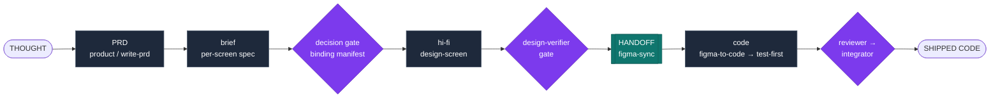

A feature in an Argo project travels through two loops — design and code — joined by one seam, the handoff. Each stage has one owner (a skill or agent), a defined input and output, and a gate that must pass before the next stage starts.

## The stages

| # | Stage | Owner | Gate before moving on |
|---|-------|-------|------------------------|
| 1 | Product | `write-prd` | Every requirement has an acceptance pair; the user confirmed each screen's layout sketch. |
| 2 | Grill (as needed) | `grill-me` | No unresolved guess remains. |
| 3 | Brief | the design author | The brief covers every requirement the PRD marks visible-in-build for that screen. |
| 4 | Decision gate | `design-screen` | The binding manifest passes registry-existence and confusable-pairs checks. |
| 5 | Hi-fi | `design-screen` / `design-component` | A hard design-rules audit plus a deterministic instance-presence check; `design-verifier` (adversarial, given only the PRD and screenshots) rules every requirement present. |
| 6 | Sync | `figma-sync` | The target component has a `story-map.json` entry. |
| 7 | Handoff to code | `figma-to-code` | Tiered acceptance gates in order: spec-diff, then gestalt, then baseline commit. |
| 8 | Feature build | `test-first` / `build-plan` | Commit gates and receipts — a red-proof, then a green-proof, per slice. |
| 9 | Review, debug, land | `reviewer` · `root-cause` · `integrator` | Merge-gate review passes. |

There is no separate lo-fi wireframing stage — layout exploration happens as text, inside the PRD interview, where changing a layout costs one edit and one question to the user rather than a Figma file to keep in sync.

## The handoff

The handoff is the design-to-code bridge, done in two steps rather than one:

1. **`figma-sync`** dumps the Figma design source of truth into committed artifacts: the story-map (Figma node to code component), design tokens, per-variant specs, and reference screenshots.
2. **`figma-to-code`** reads those committed artifacts and generates the component through the normal test-first loop — never straight from a live Figma read, so code generation never depends on Figma being reachable at build time.

See [the gates](/how-it-works/the-gates/) for how each checkpoint above actually enforces itself, and [the trust model](/how-it-works/the-trust-model/) for why that enforcement is mechanical rather than requested.
